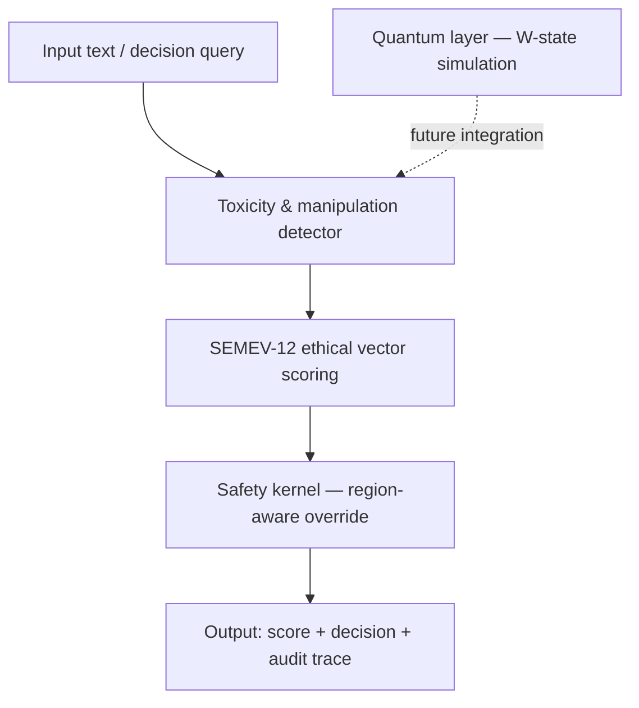

# QERRA-v2

**Hybrid Quantum-Classical Ethical Decision Engine**  
An open-source safety layer for humanoid robots and high-stakes AI systems.

**Author:** Marussa Metocharaki ([@marunigno](https://github.com/marunigno-ship-it)) — Solo researcher, Greece  
**License:** AGPL-3.0 | **Status:** Early experimental prototype

---

## ⚠️ Project status

This is an early-stage research prototype built by a single independent researcher.

| Component | Status | Notes |
|---|---|---|
| Toxicity detector | ✅ Live | Uses Detoxify (multilingual) + deception classifier |
| Safety kernel | ✅ Live | Region-aware logic (EU / USA / UAE modes) |
| SEMEV-12 ethical vectors | 🔶 Partial | Heuristic implementation — not yet validated |
| Quantum layer (W-state) | 🔶 Simulated | Real 8-qubit run on IBM hardware completed Jan 2026; not yet in API |
| Post-quantum crypto (Kyber-768) | 🔶 Prototype | Key generation and encapsulation implemented; not production-hardened |
| ROS2 integration | ⬜ Planned | Stub only |

The classical safety layer is functional. The quantum layer is a simulation. No robotic hardware integration exists yet. Do not use this in production safety-critical systems.

---

## What QERRA-v2 does

QERRA-v2 analyses text inputs through a multi-layer pipeline:

1. **Toxicity & manipulation detection** — uses the Detoxify multilingual model + variance-based conversational drift tracking


2. **Ethical vector scoring (SEMEV-12)** — applies 12 ethical dimensions derived from human values (early heuristic version)
3. **Safety kernel** — applies region-aware override logic with audit trace output
4. **Post-quantum access control** — Kyber-768 encrypted asset access with ethical gating

A live API endpoint is available for testing the toxicity and safety kernel layers.

---

## Live API

Base URL: `https://qerra-v2-api-production.up.railway.app`  
Docs: [`/docs`](https://qerra-v2-api-production.up.railway.app/docs)  
Public demo key: `qerra2026_public_demo_key` (rate-limited, read-only)

```bash
curl -X POST https://qerra-v2-api-production.up.railway.app/v1/analyze \
  -H "x-api-key: qerra2026_public_demo_key" \
  -H "Content-Type: application/json" \
  -d '{"text": "I love helping people"}'
```

See [API-DEMO.md](API-DEMO.md) for full examples and known limitations.

---

## Architecture



---

## Quantum proof of concept

A real 8-qubit W-state was successfully executed on IBM quantum hardware in January 2026.  
Job ID: `598eb802-0a56-428c-aec0-b23edca61e3c`  
See: [8qubit-wstate-qubs repo](https://github.com/marunigno-ship-it/8qubit-wstate-qubs) and [QUANTUM-STATUS.md](QUANTUM-STATUS.md)

The live API currently uses classical simulation of this layer.

---

## Local setup

```bash
git clone https://github.com/marunigno-ship-it/QERRA-v2.git
cd QERRA-v2
pip install -r requirements.txt
python qerra.py
```

---

## Documentation

- [WHITEPAPER.md](WHITEPAPER.md) — Full project vision and architecture
- [ARCHITECTURE.md](ARCHITECTURE.md) — Component definitions and implementation status
- [QUANTUM-STATUS.md](QUANTUM-STATUS.md) — Quantum layer: demonstrated vs simulated
- [API-DEMO.md](API-DEMO.md) — Live API examples and limitations
- [CONTRIBUTING.md](CONTRIBUTING.md) — How to contribute

---

## Support this project

QERRA-v2 is built entirely by a solo researcher under significant personal constraints.  
If you find it valuable, please consider [GitHub Sponsors](https://github.com/sponsors/marunigno-ship-it) or simply starring the repo.
