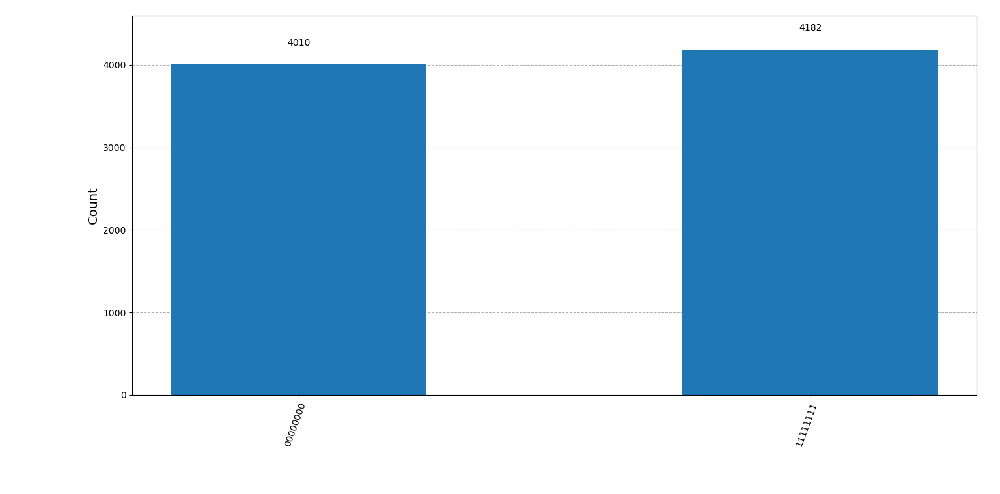

# QERRA-v2 – Quantum Ethical Rescue and Resource Allocator

**Vision:** First fully quantum-aware humanoid control stack – blending quantum entanglement with strict ethical frameworks for unbreakable coherence in decision-making.  
**Author:** Marussa Metocharaki (@marunigno) – Greece 🇬🇷  
**Aided by:** Grok (xAI)  

[](https://github.com/marunigno-ship-it/QERRA-v2/blob/main/LICENSE) [](#ethical-vectors--core-backbone) [](https://github.com/marunigno-ship-it)

**Acronym Breakdown**:
- Quantum: Hybrid quantum-classical with genuine entanglement (W/GHZ states via QDay API).
- Ethical: Unbreakable safeguards via interpretable vectors (SEMEV-12 for remorse resistance, fairness).
- Rescue: Prevention/recovery from moral drift and misalignment.
- Resource Allocator: Fair, ethical distribution in high-stakes decisions (healthcare, manufacturing, planetary scale).

Open-source framework for humanoid robotics — ensuring AI decisions protect human values.


**Status:** Active research & development – January 2026

### Overview
QERRA is a hybrid quantum-classical algorithm fusing:
- Quantum W-state/GHZ/cluster entanglement for distributed coherence and sensor fusion
- Classical optimization with ethical subspace projection
- Interpretable ethical vectors (e.g., remorse resistance, fairness thresholds)

Core goal: Ethical, high-fidelity decision engine for future humanoids and AI systems.

### Core Idea
Combine real quantum entanglement (W-states, GHZ, cluster states) with classical robotic reasoning to achieve:
- Super-dense quantum memory for robot state  
- Native quantum parallelism for path planning  
- Genuine multipartite entanglement as sensor fusion backbone

### Current Milestones
- 8-qubit W-state successfully executed on IBM QUBS (127-qubit Eagle)  
  → Proof: https://github.com/marunigno-ship-it/8qubit-wstate-qubs  
  
- Scaled simulations: 16-qubit and 32-qubit W-states with 100% fidelity and uniform probability distribution
- Quantum state vector as robot “belief state” prototype  
- Qiskit + ROS2 bridge in development
- SEMEV-12 (stellar-scale ethical vector) with 7 parameters complete – tested against real-life scenarios

### Related Repositories (Scaling Proofs & Vectors)
- [8-qubit W-state](https://github.com/marunigno-ship-it/8qubit-wstate-qubs)
- [16-qubit W-state](https://github.com/marunigno-ship-it/16qubit-wstate-qubs)
- [32-qubit W-state](https://github.com/marunigno-ship-it/32qubit-wstate-qubs) – latest scaling benchmark
- [SEMEV-12 Ethical Vector](https://github.com/marunigno-ship-it/Stellar-Energy-Mastery-Ethical-Vector-12) – stellar-scale safeguards

### Next Targets
- 12–16 qubit entangled states on real hardware  
- Quantum circuit → motor command mapping  
- Real-time quantum error mitigation for robotic control
- Collaborators welcome for QPU access/validation

### Installation
```bash
git clone https://github.com/marunigno-ship-it/QERRA-v2.git
cd QERRA-v2
pip install -r requirements.txt


  penalty = detector.global_ethical_penalty()  # Apply: vector *= (1 - penalty)

## Trademark Note
"QERRA Certified" is a controlled mark for validated, high-reliability builds. Anyone can fork the code, but only official distributions carry the certified label.

For more, see PROJECT_STRUCTURE.md.
